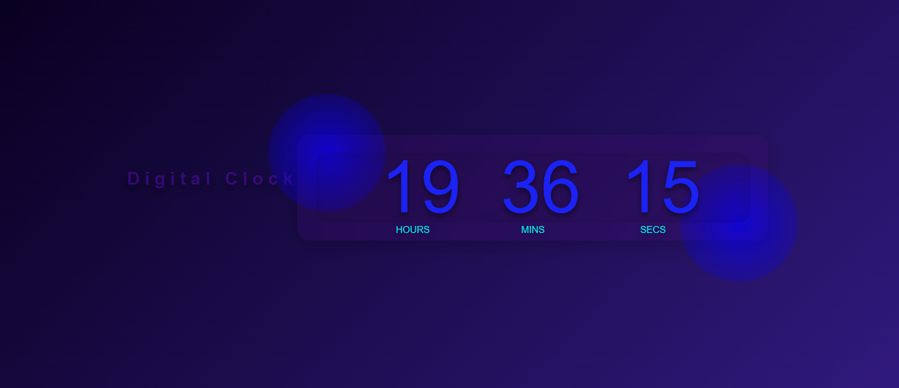

# DigitalClock
 Digital Clock is a simple web application that displays the current time in a digital format. Built with HTML, CSS, and JavaScript, this clock features a modern design with a gradient background, resizable text, and a responsive layout. The clock updates every second to show hours, minutes, and seconds in a stylish and user-friendly interface. 
